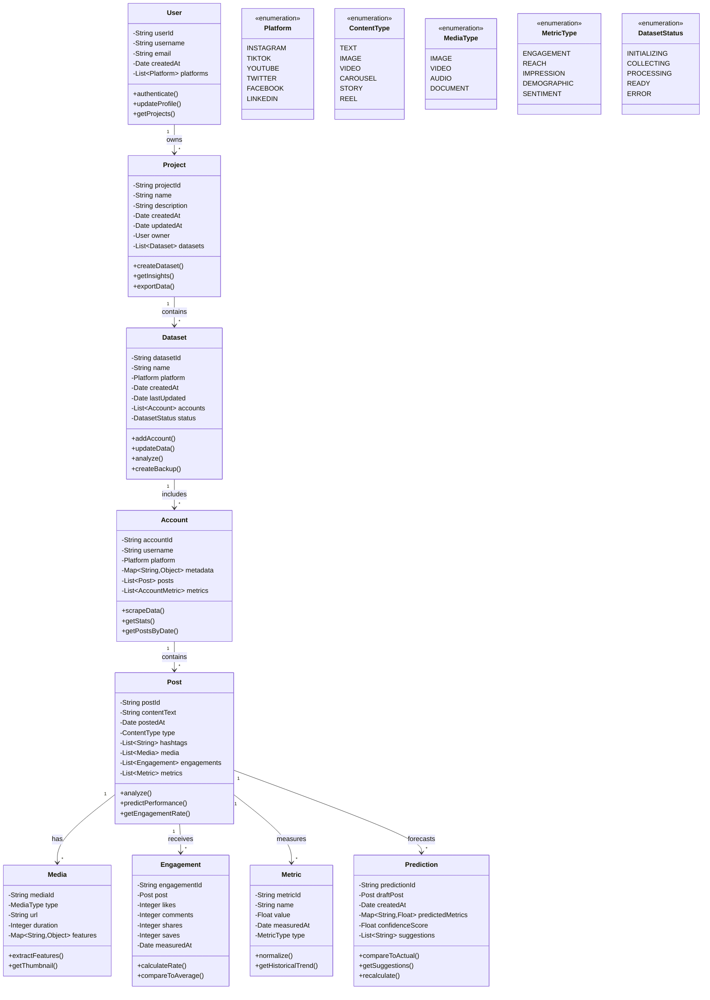
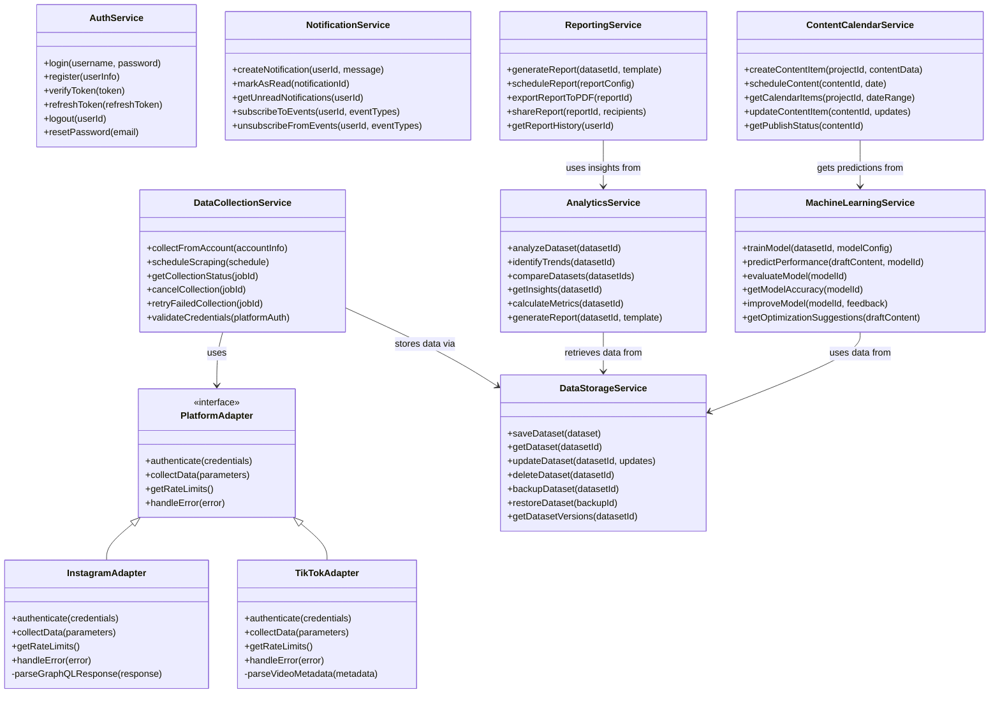
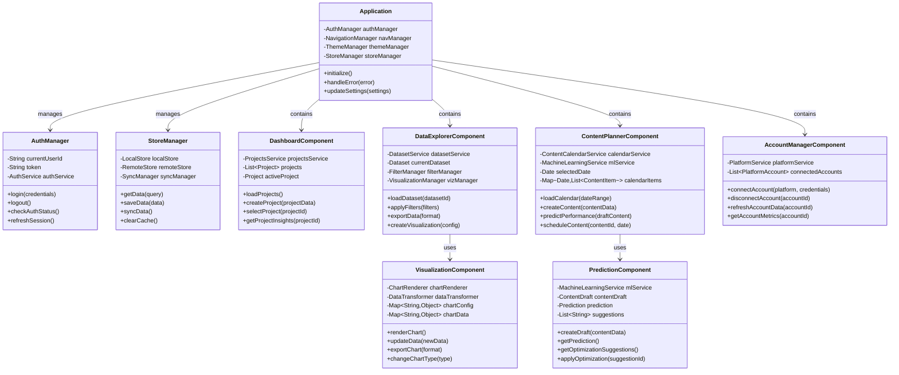
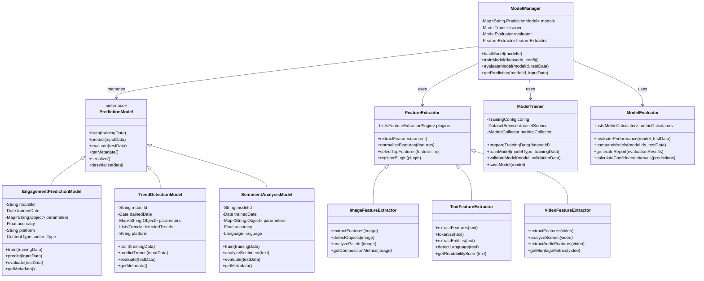

# Class Diagrams

This document provides class diagrams for the major components of the CherryBomb system, highlighting the object-oriented architecture and relationships between classes.

## Core Domain Model

## Service Layer

## Frontend Component Classes

## Machine Learning Classes

These class diagrams illustrate the main components and their relationships in the CherryBomb system, providing a blueprint for implementation while maintaining flexibility for future development.
