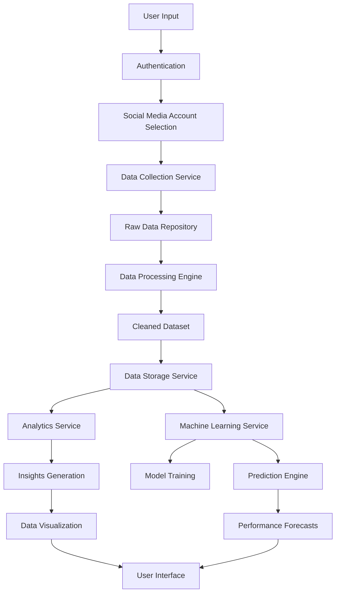
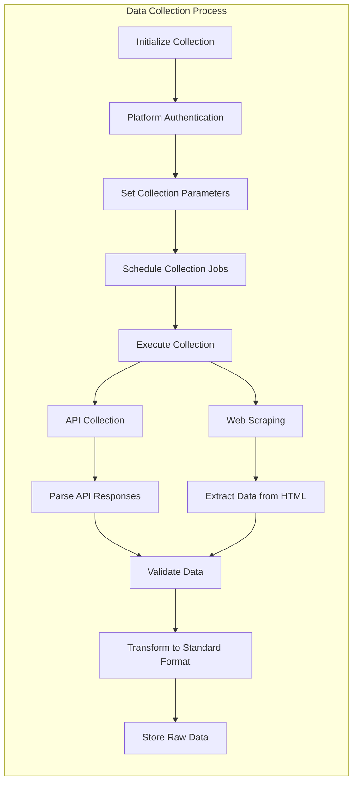
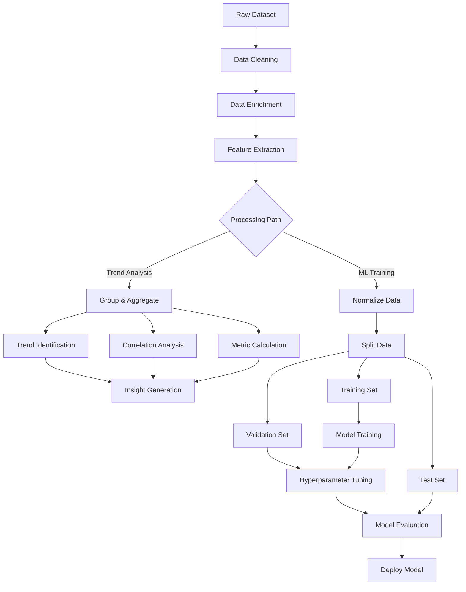
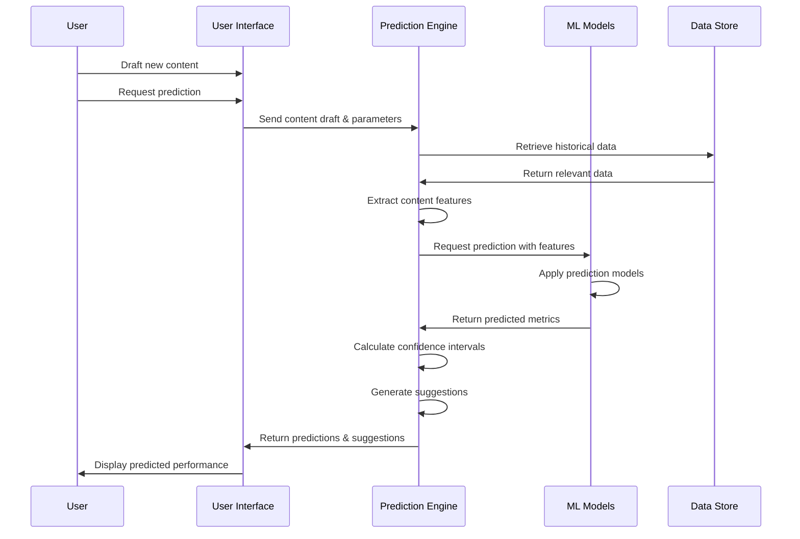
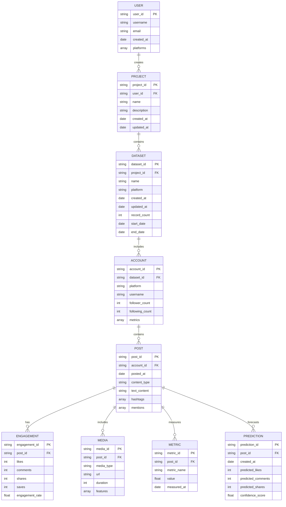

# Data Flow Diagrams

This document illustrates the flow of data throughout the CherryBomb system, from initial collection to final presentation and prediction.

## Main Data Flow

## Data Collection Flow

## Analytics Processing Flow

## Content Prediction Flow

## Data Storage Architecture

These diagrams provide a comprehensive overview of how data flows through the CherryBomb system, from collection and processing to analysis and prediction.
