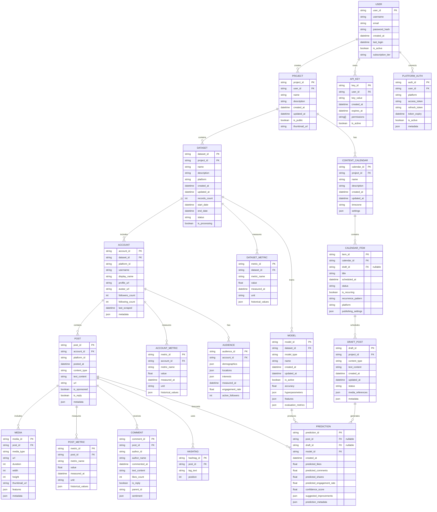
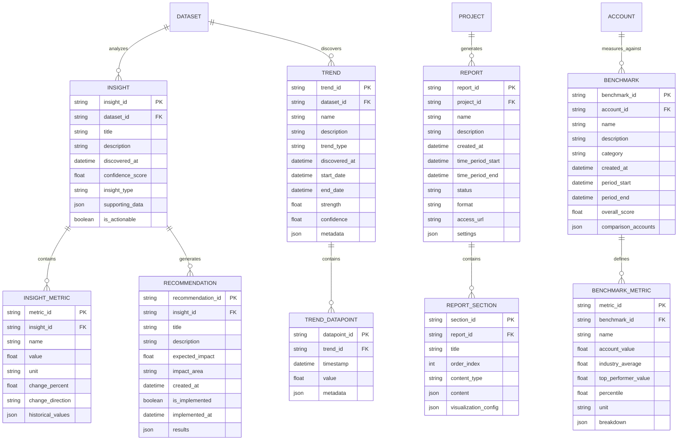
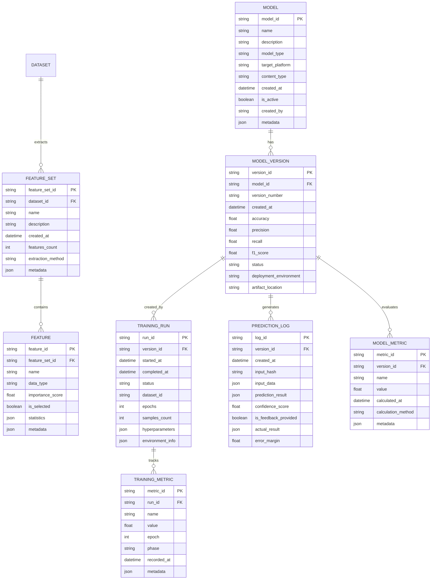
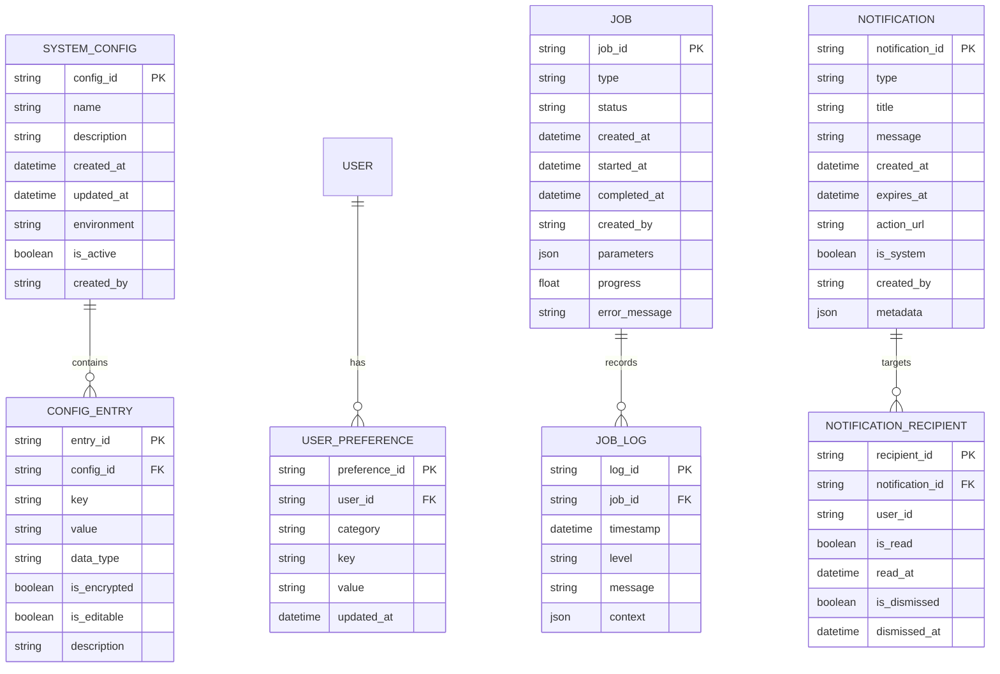

# Entity-Relationship Diagrams

This document provides detailed entity-relationship diagrams for the CherryBomb database structure, illustrating how data is organized and related within the system.

## Core Data Model

## Analytics Data Model

## Machine Learning Data Model

## System Configuration Data Model

These entity-relationship diagrams provide a comprehensive view of the data model for CherryBomb, illustrating how different entities relate to each other and what attributes they contain. This structure supports all the core functionality while maintaining flexibility for future expansion.
