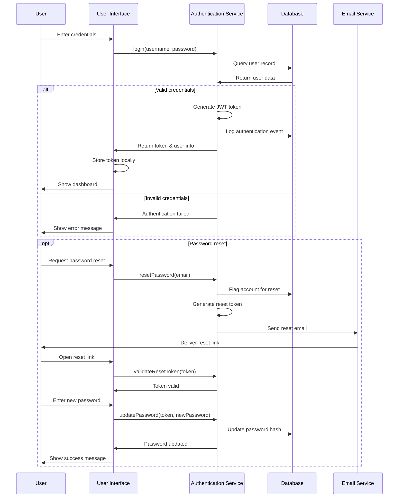
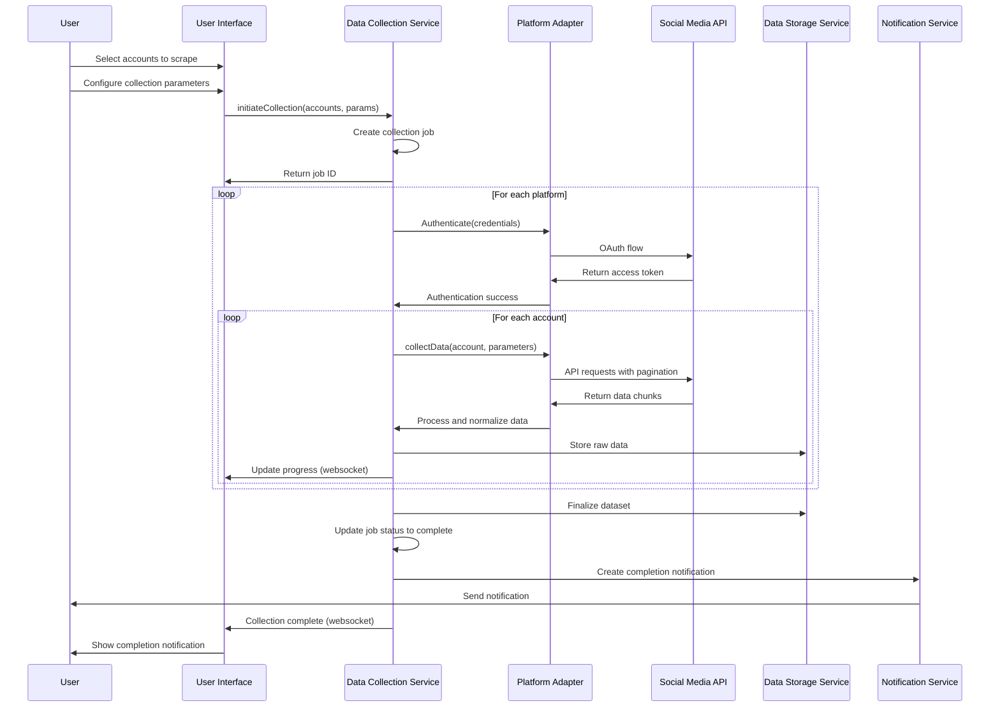
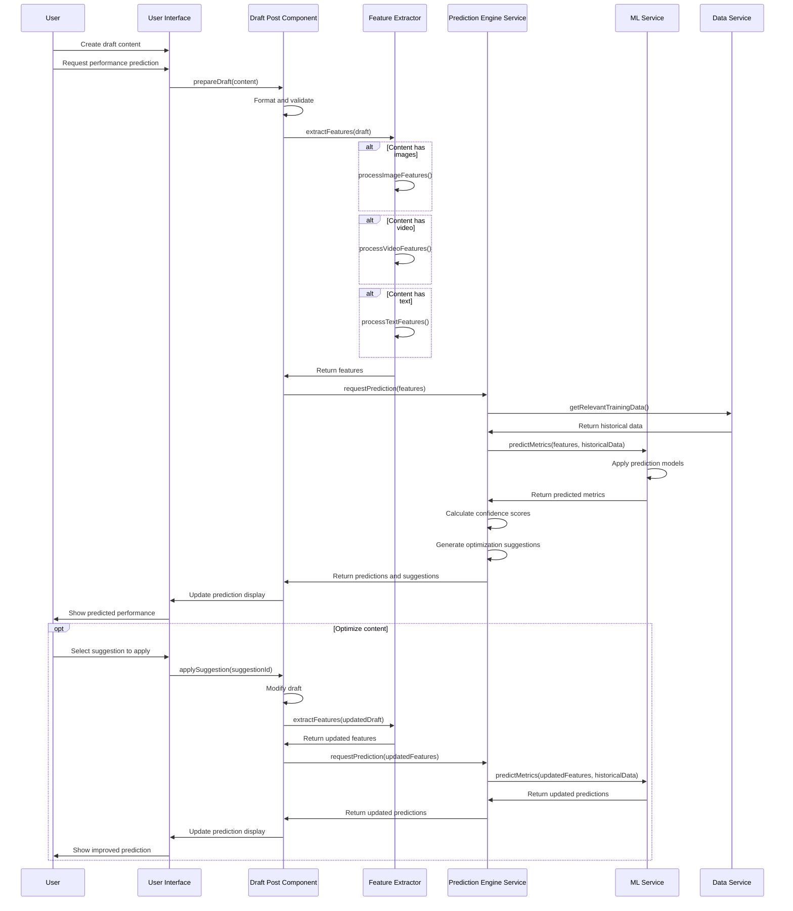
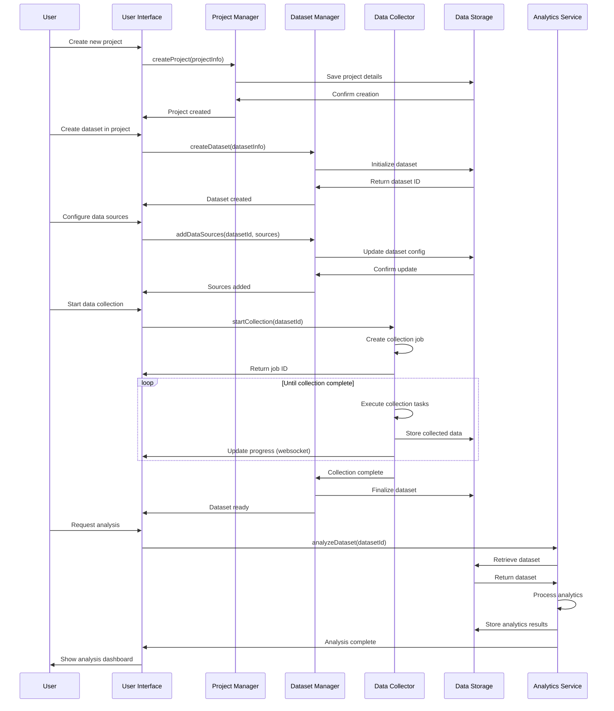
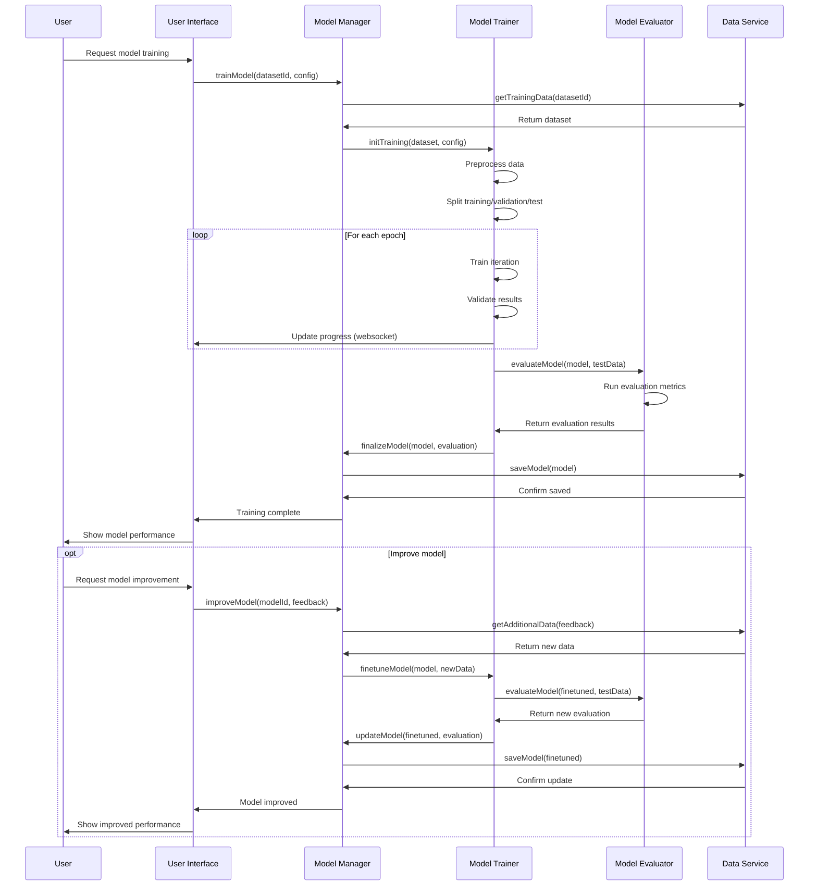
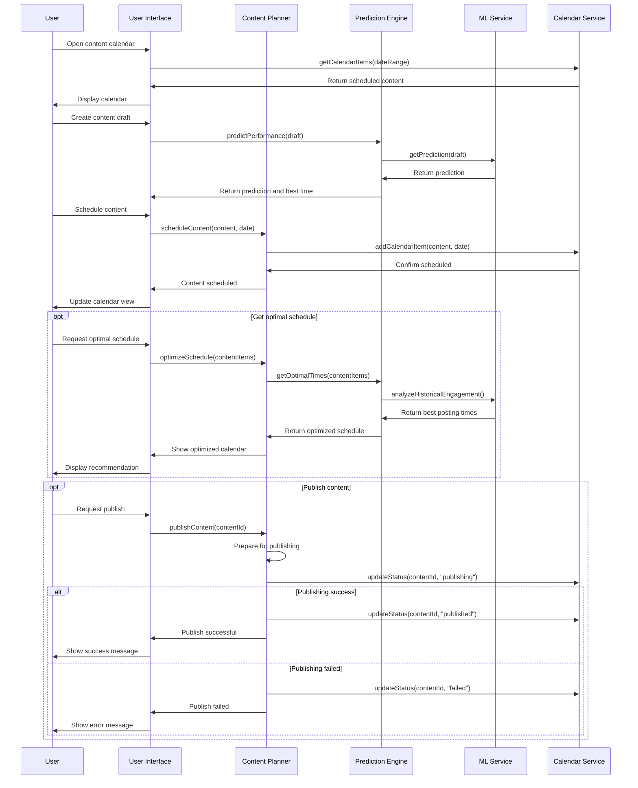

# Sequence Diagrams

This document provides sequence diagrams illustrating the key flows and interactions between components in the CherryBomb system.

## User Authentication Flow

## Data Collection Flow

## Content Analysis & Prediction Flow

## Dataset Creation & Analysis Flow

## Model Training & Improvement Flow

## Content Calendar Workflow

These sequence diagrams illustrate the key interactions between components in the CherryBomb system, providing a clear understanding of the data flows and user journeys throughout the application.
