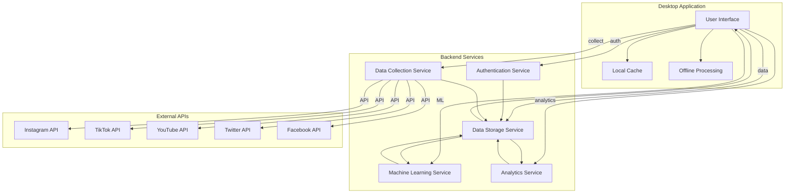

# System Architecture Overview

CherryBomb is built as a cross-platform desktop application using Electron with a modular architecture that enables powerful social media data analysis, prediction, and content optimization.

## High-Level Architecture

## Component Descriptions

### Desktop Application Components

- **User Interface**: Electron-based responsive UI providing data visualization, account management, and content planning features
- **Local Cache**: SQLite database storing user preferences, temporary data, and offline-accessible datasets
- **Offline Processing**: Enables limited analysis and prediction capabilities when not connected to backend services

### Backend Services

- **Authentication Service**: Handles user authentication, authorization, and session management
- **Data Storage Service**: Manages the core database, data versioning, and data access patterns
- **Machine Learning Service**: Hosts predictive models, performs model training, and generates content performance predictions
- **Analytics Service**: Processes raw data into actionable insights, identifies trends, and calculates performance metrics
- **Data Collection Service**: Orchestrates the collection of data from various social media platforms through APIs and web scraping techniques

### External Integrations

CherryBomb integrates with major social media platforms through their respective APIs:

- Instagram Graph API
- TikTok Developer API
- YouTube Data API
- Twitter API v2
- Facebook Graph API

## Deployment Options

CherryBomb can be deployed in different configurations:

1. **Standalone Mode**: All services run locally on the user's machine
2. **Cloud Connected Mode**: Desktop app connects to CherryBomb cloud services for enhanced processing power
3. **Enterprise Mode**: Custom deployment with on-premise backend services

## Technology Stack

- **Frontend**: Electron, React, D3.js for visualization
- **Backend**: Node.js, Python for ML components
- **Databases**: PostgreSQL (primary data store), Redis (caching), SQLite (local cache)
- **ML Framework**: TensorFlow/PyTorch
- **DevOps**: Docker, Kubernetes for service orchestration
- **Authentication**: OAuth 2.0, JWT

## System Requirements

| Component | Minimum | Recommended |
|-----------|---------|-------------|
| CPU | 4 cores | 8+ cores |
| RAM | 8GB | 16GB+ |
| Storage | 500MB + dataset storage | 1GB + SSD storage for datasets |
| OS | Windows 10, macOS 10.15, Ubuntu 18.04 | Latest OS versions |
| Internet | 10 Mbps | 50+ Mbps |
