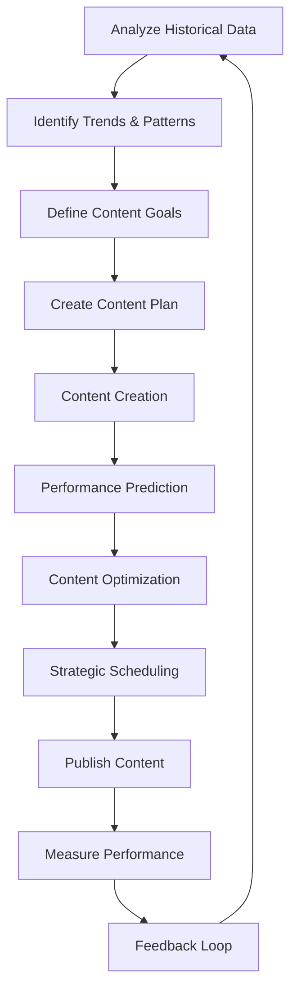
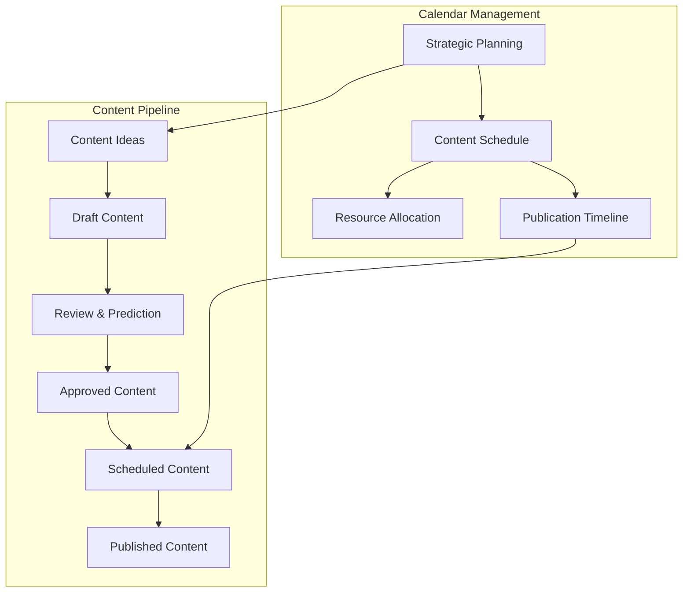
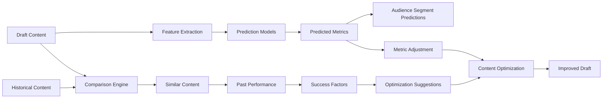
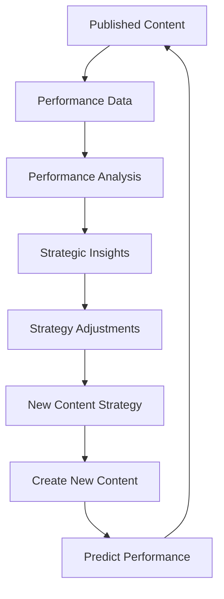

# Content Strategy

Effective content strategy is the foundation of social media success. CherryBomb provides powerful tools to develop, analyze, and optimize your content strategy based on data-driven insights and performance predictions. This document explains the core concepts of content strategy within CherryBomb and how to leverage them.

## Understanding Content Strategy in CherryBomb

Content strategy in CherryBomb refers to the systematic approach of planning, creating, scheduling, and analyzing content across social media platforms to achieve specific objectives.

### The Content Strategy Framework

## Content Strategy Development

### Data-Driven Strategy Creation

CherryBomb analyzes your historical content performance to identify patterns and opportunities:

1. **Performance Analysis**: Review of past content performance
2. **Audience Insights**: Understanding of audience preferences and behaviors
3. **Content Audit**: Assessment of content types, formats, and themes
4. **Gap Analysis**: Identification of content opportunities
5. **Competitive Benchmarking**: Comparison with competitors' strategies

### Strategy Components

A comprehensive content strategy in CherryBomb addresses these components:

| Component | Description | CherryBomb Tools |
|-----------|-------------|------------------|
| **Content Pillars** | Core themes and topics | Topic cluster analysis, relevance scoring |
| **Content Mix** | Balance of content types | Content type impact analysis, format effectiveness |
| **Posting Cadence** | Frequency and timing | Optimal timing prediction, audience activity analysis |
| **Platform Strategy** | Platform-specific approaches | Cross-platform performance comparison, platform strength analysis |
| **Content Goals** | Specific objectives | Goal setting, KPI tracking, projection tools |
| **Voice & Style** | Consistent brand presence | Style analysis, brand consistency scoring |

## Strategy Implementation

### Content Calendar

The Content Calendar is the central tool for implementing your content strategy:

Features of the CherryBomb Content Calendar:

- **Visual Timeline**: Drag-and-drop interface for content scheduling
- **Multi-Platform View**: Unified calendar across all platforms
- **Content Pipeline**: Track content from idea to publication
- **Smart Scheduling**: AI-recommended posting times
- **Content Balance Analysis**: Visual representation of content mix
- **Workflow Management**: Assign tasks and track progress

### Content Briefs

Create comprehensive content briefs based on strategic insights:

- **Performance-Based Guidance**: Recommendations based on historical performance
- **SEO Integration**: Keyword suggestions and search trend incorporation
- **Format Recommendations**: Suggested content formats for maximum engagement
- **Reference Content**: Links to high-performing content as examples
- **Brand Guidelines**: Integrated style and voice requirements

## Performance Prediction & Optimization

### Predictive Content Analysis

Before publishing, CherryBomb predicts how your content will perform:

### Optimization Recommendations

CherryBomb provides actionable recommendations to improve content performance:

1. **Caption Optimization**: Text improvements for better engagement
2. **Visual Enhancements**: Image and video adjustments
3. **Hashtag Recommendations**: Optimal hashtag selection and placement
4. **Timing Suggestions**: Best publication times for maximum reach
5. **Format Adjustments**: Format modifications for better performance
6. **Call-to-Action Improvements**: More effective CTAs

## Performance Analysis & Learning

### Post-Publication Analysis

After publishing, CherryBomb provides detailed performance analysis:

- **Prediction Accuracy**: Comparison of predicted vs. actual performance
- **Engagement Breakdown**: Analysis of engagement by type and audience segment
- **Performance Factors**: Identification of elements that drove performance
- **Benchmark Comparison**: Performance relative to your averages and competitors
- **Learning Insights**: Key takeaways for future content

### Strategy Adaptation

CherryBomb helps you continuously refine your content strategy:

## Advanced Content Strategy Features

### A/B Testing Framework

Systematically test content variations to optimize performance:

- **Variation Creation**: Tools to create controlled content variations
- **Test Design**: Define test parameters and success metrics
- **Results Analysis**: Statistical analysis of performance differences
- **Learning Integration**: Automatic incorporation of findings into recommendations

### Content Repurposing Engine

Identify opportunities to repurpose content across platforms:

- **Repurposing Suggestions**: AI-driven recommendations for content adaptation
- **Cross-Platform Translation**: Guidelines for platform-specific optimization
- **Performance Projection**: Predicted performance of repurposed content
- **Efficiency Analysis**: ROI projections for content repurposing

### Campaign Strategy Tools

Plan and execute coordinated content campaigns:

- **Campaign Planner**: End-to-end campaign planning tools
- **Theme Development**: Campaign theme and messaging development
- **Cross-Post Coordination**: Manage interconnected content pieces
- **Campaign Analytics**: Unified performance view across campaign content

## Best Practices for Content Strategy

1. **Balance Data and Creativity**: Use data insights while maintaining creative authenticity
2. **Plan at Multiple Levels**: Develop yearly, quarterly, monthly, and weekly strategic plans
3. **Maintain Strategic Flexibility**: Adapt to trends while staying true to core strategy
4. **Test Systematically**: Use structured tests to validate strategic assumptions
5. **Develop Platform-Specific Approaches**: Tailor strategy to each platform's unique environment
6. **Focus on Audience Value**: Prioritize content that delivers genuine audience value
7. **Build Strategic Content Pillars**: Develop strong content themes that support your goals

## Content Strategy Templates

CherryBomb provides customizable templates for different content strategy needs:

| Template Type | Best For | Key Features |
|---------------|----------|--------------|
| **Growth Strategy** | Audience building | Reach optimization, virality potential |
| **Engagement Strategy** | Community building | Interaction prompts, conversation starters |
| **Conversion Strategy** | Action-driven goals | CTA optimization, funnel integration |
| **Brand Awareness** | New brands/products | Recognition metrics, impression focus |
| **Authority Building** | Thought leadership | Topic expertise development, credibility signals |
| **Community Strategy** | User-generated content | Community involvement, ambassador programs |

## Measuring Strategy Success

CherryBomb provides comprehensive tools to measure the success of your content strategy:

### Key Performance Indicators

Track the most relevant KPIs for your strategy:

- **Reach Metrics**: Impressions, follower growth, reach percentage
- **Engagement Metrics**: Likes, comments, shares, saves, engagement rate
- **Action Metrics**: Click-through rate, conversion actions, website visits
- **Content Metrics**: Top-performing content, format effectiveness
- **Audience Metrics**: Growth rate, demographic changes, loyalty metrics

### Strategic Impact Analysis

Measure the broader impact of your content strategy:

- **Goal Achievement**: Progress toward defined strategic goals
- **Competitive Position**: Performance relative to competitors
- **Brand Perception**: Changes in audience sentiment and perception
- **Efficiency Metrics**: Resource investment vs. results
- **Strategic Alignment**: How well execution matched strategic intent
