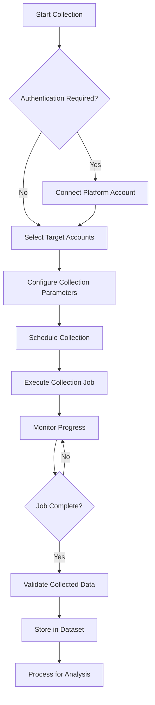

# Data Collection

Data collection is a core feature of CherryBomb that enables you to gather social media content, engagement metrics, and audience information from various platforms. This guide explains how data collection works and best practices for effective data gathering.

## Overview

CherryBomb's data collection capabilities allow you to:

1. **Scrape social media accounts** - Collect posts, comments, engagement metrics, and profile information
2. **Build comprehensive datasets** - Organize collected data into structured datasets for analysis
3. **Automate collection processes** - Schedule recurring data collection to keep datasets current
4. **Respect platform limitations** - Work within platform API restrictions and rate limits

## Supported Platforms

CherryBomb can collect data from the following social media platforms:

| Platform | Content Types | Metrics Available | Collection Methods |
|----------|---------------|-------------------|-------------------|
| Instagram | Posts, Stories, Reels | Likes, Comments, Views, Engagement Rate | API, Scraping |
| TikTok | Videos | Likes, Comments, Shares, Views | API, Scraping |
| YouTube | Videos, Shorts, Community Posts | Views, Likes, Comments, Watch Time | API |
| Twitter | Tweets, Threads | Likes, Retweets, Replies, Impressions | API |
| Facebook | Posts, Videos | Reactions, Comments, Shares, Reach | API |
| LinkedIn | Posts, Articles | Reactions, Comments, Shares, Impressions | API |

## Collection Methods

### API Collection

When available, CherryBomb uses official platform APIs to collect data. This method:

- Is more reliable and stable
- Provides richer metadata
- Has clear rate limits
- Requires platform-specific authentication

### Web Scraping

For platforms with limited API access or to gather data not available through APIs, CherryBomb can use web scraping techniques. This method:

- Accesses publicly available data only
- May be less stable due to platform interface changes
- Operates at a slower rate to avoid detection
- Does not require account authentication for public profiles

## Data Collection Process

### Step 1: Authentication

Most platforms require authentication to access their APIs:

- **User Authentication**: Connect your own social media accounts
- **Developer Auth**: Use API credentials for platforms that require developer accounts
- **Public Data**: No authentication needed for public profiles (in scraping mode)

### Step 2: Target Selection

Select the accounts you want to collect data from:

- Your own connected accounts
- Competitor accounts (public profiles only)
- Industry leaders or influencers in your niche
- Accounts discovered through keyword search

### Step 3: Configuration

Configure what data you want to collect:

- **Content Types**: Posts, videos, stories, etc.
- **Time Range**: Historical data period
- **Depth**: How many posts, comments to collect
- **Frequency**: One-time or recurring collection

### Step 4: Execution

CherryBomb executes the collection job:

1. **Initialization**: Prepare the collection environment
2. **Data Gathering**: Retrieve data from platforms
3. **Normalization**: Convert platform-specific formats to standard schema
4. **Storage**: Save raw data to temporary storage

### Step 5: Validation & Processing

After collection completes:

1. **Validation**: Check for missing data or errors
2. **Deduplication**: Remove duplicate content
3. **Enrichment**: Add derived metrics
4. **Indexing**: Optimize for query performance

## Collection Best Practices

### Respect Platform Terms of Service

Always ensure your data collection activities comply with each platform's terms of service:

- Only collect publicly available data
- Adhere to rate limits
- Do not attempt to bypass access restrictions
- Use official APIs when available

### Optimize Collection Frequency

Balance data freshness with system resources:

- **Trending Content**: Daily or more frequent collection
- **Competitor Analysis**: Weekly collection
- **Historical Analysis**: Monthly or quarterly
- **Campaign Monitoring**: Align with campaign schedule

### Manage Data Volume

Consider storage and processing implications:

- Start with a modest data scope and expand as needed
- Use time-based filters to limit historical data
- Prioritize high-engagement accounts for detailed collection
- Archive older data that's not actively used

### Handle Rate Limiting

CherryBomb automatically manages rate limits, but you should:

- Distribute collection across longer periods for large datasets
- Schedule collections during off-peak hours
- Use multiple authorized accounts when available
- Set up retry mechanisms for temporarily failed collections

## Advanced Collection Features

### Intelligent Sampling

For very large accounts, CherryBomb can use intelligent sampling to collect a representative subset of data:

- Statistical sampling of posts across time periods
- Focus on high-engagement content
- Balanced selection across content types
- Preservation of trend indicators

### Delta Collection

To optimize resource usage, delta collection only gathers new or changed data since the last collection:

- Track last collection timestamp per account
- Identify and collect only new content
- Update engagement metrics on existing content
- Detect and handle deleted content

### Cross-Platform Collection

Collect related data across multiple platforms:

- Track the same campaign across different platforms
- Collect from the same creator's accounts on multiple platforms
- Compare performance of similar content types across platforms

## Data Collection Ethics

CherryBomb is designed with ethical data collection in mind:

- **Respect Privacy**: Only collect publicly available information
- **Transparent Usage**: Be clear about how collected data will be used
- **Secure Storage**: Keep collected data secure and protected
- **Minimal Collection**: Only collect what you need for your analysis

## Troubleshooting Common Issues

### Collection Job Fails

Common causes and solutions:

1. **Authentication Issues**: Reconnect the platform account
2. **Rate Limiting**: Adjust collection parameters or schedule for off-peak times
3. **Account Privacy Changes**: Verify the account is still public
4. **Platform Changes**: Check for platform API or interface updates

### Missing or Incomplete Data

If your collection has gaps:

1. **Check Collection Logs**: Review for specific errors
2. **Adjust Time Ranges**: Break large date ranges into smaller periods
3. **Verify Account Status**: Ensure target accounts are active
4. **Update Platform Adapters**: Ensure you're using the latest CherryBomb version

### Slow Collection Performance

To improve collection speed:

1. **Limit Collection Scope**: Reduce time range or number of posts
2. **Optimize Concurrency**: Adjust parallel collection settings
3. **Schedule Strategically**: Run large collections during off-peak hours
4. **Upgrade Resources**: Consider more powerful hardware or cloud resources
