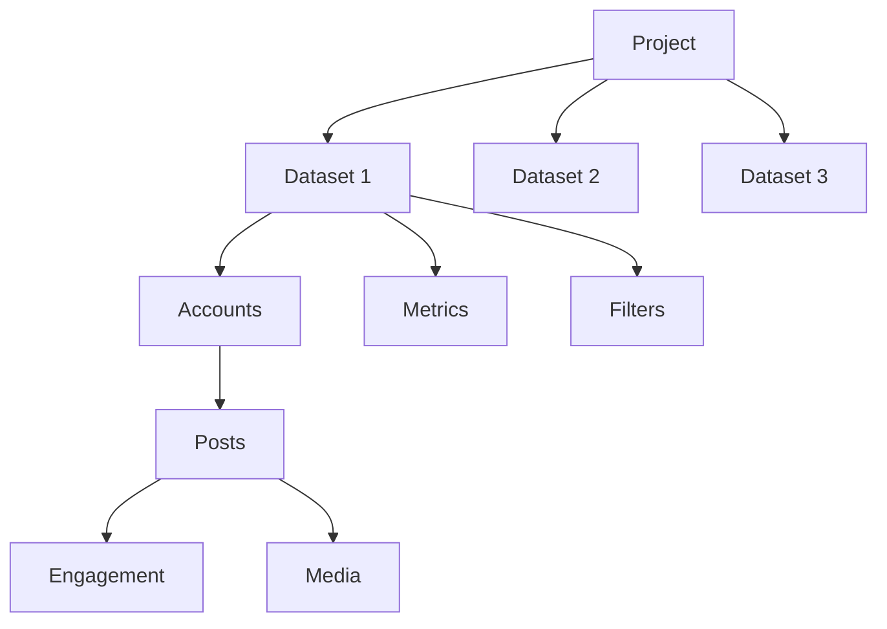
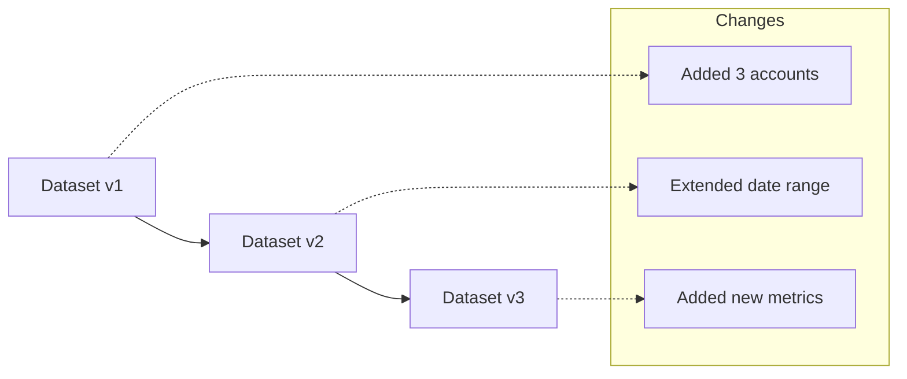

# Dataset Management

Dataset management is a fundamental aspect of CherryBomb that allows you to organize, maintain, and leverage your collected social media data efficiently. This document explains the concepts and best practices for effective dataset management.

## Understanding Datasets in CherryBomb

A dataset in CherryBomb is a structured collection of social media data organized for analysis and prediction purposes. Datasets can contain various types of information:

- **Content data**: Posts, videos, stories, and other content items
- **Engagement metrics**: Likes, comments, shares, views, etc.
- **Temporal information**: Posting times, engagement patterns over time
- **Account information**: Profile data, audience demographics, etc.

### Dataset Architecture

## Creating and Configuring Datasets

### Creating a New Dataset

1. Navigate to the Datasets tab in your project
2. Click "Create New Dataset"
3. Provide a name and description
4. Configure the dataset parameters:
   - **Data sources**: Select accounts to include
   - **Date range**: Specify the time period for data collection
   - **Content types**: Choose which types of content to include
   - **Metrics**: Select which metrics to track

### Dataset Types

CherryBomb supports several types of datasets for different analytical purposes:

| Dataset Type | Description | Use Cases |
|--------------|-------------|-----------|
| **Account Analysis** | Focused on a single account's performance | Content audit, historical analysis |
| **Competitor Analysis** | Compare multiple accounts in the same niche | Benchmarking, gap analysis |
| **Trend Discovery** | Broad collection across many accounts | Identify emerging trends, content types |
| **Campaign Tracking** | Content around specific hashtags or themes | Campaign performance analysis |
| **Niche Analysis** | Focused on a specific content niche | Understanding niche performance patterns |

## Managing Dataset Growth

As you collect data over time, your datasets will grow. CherryBomb provides tools to manage this growth:

### Data Retention Policies

Configure retention policies to automatically:

- Archive older data
- Downsample historical data (maintain daily/weekly summaries instead of full data)
- Filter out low-value data points

### Dataset Versioning

CherryBomb maintains dataset versions to track changes over time:

## Merging and Splitting Datasets

### Merging Datasets

Combine multiple datasets when you want to:

- Unify analysis across projects
- Combine historical and new data
- Create a master dataset from specialized ones

To merge datasets:

1. Select the datasets to merge
2. Configure conflict resolution policies
3. Specify which data to include/exclude
4. Create a new dataset or update an existing one

### Splitting Datasets

Divide a dataset when you want to:

- Create specialized subsets for focused analysis
- Separate data by platform, time period, or content type
- Improve performance by working with smaller datasets

## Exporting and Importing Datasets

### Export Formats

CherryBomb supports exporting datasets in multiple formats:

- **CherryBomb Format** (.cberryds): Preserves all metadata and relationships
- **CSV**: For spreadsheet analysis
- **JSON**: For programmatic processing
- **SQL**: For database import

### Import Options

You can import data from various sources:

- Other CherryBomb projects
- Third-party analytics tools
- Manual data collections
- CSV/Excel files

## Dataset Analytics

CherryBomb provides built-in analytics specifically for understanding your datasets:

- **Data Quality Metrics**: Completeness, accuracy, and consistency
- **Coverage Analysis**: Identify gaps in your data collection
- **Size and Growth Projections**: Manage storage requirements
- **Usage Patterns**: Track which datasets are most valuable

## Best Practices for Dataset Management

1. **Create Purpose-Specific Datasets**: Rather than one massive dataset, create focused ones for specific analysis goals
2. **Regular Maintenance**: Schedule periodic dataset cleanup and optimization
3. **Document Your Datasets**: Use descriptions and tags to track what each dataset contains
4. **Version Critical Datasets**: Before making major changes, create a snapshot version
5. **Balance Size and Detail**: Collect the data you need, but be mindful of diminishing returns with extremely large datasets

## Advanced Dataset Features

### Automated Enrichment

CherryBomb can automatically enrich your datasets with:

- **Sentiment Analysis**: Add sentiment scores to text content
- **Visual Classification**: Categorize images and videos
- **Topic Extraction**: Identify key topics in your content
- **Engagement Patterns**: Calculate derived metrics like engagement rate

### Real-time Datasets

For active campaigns or trending topics, configure real-time datasets that:

- Update automatically at short intervals
- Provide alerts for significant changes
- Feed directly into dashboards

### Collaborative Datasets

For team environments, collaborative datasets allow:

- Shared access with permission controls
- Annotation and commenting
- Change tracking and activity logs
- Synchronized updates across team members
