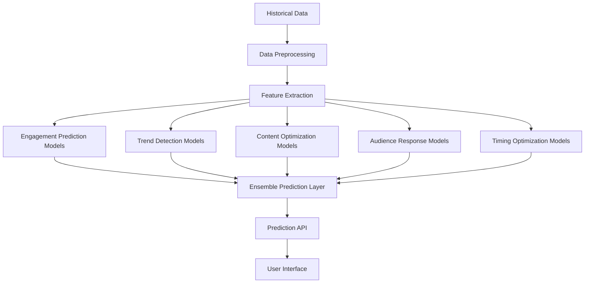
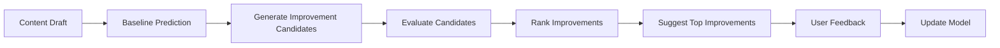
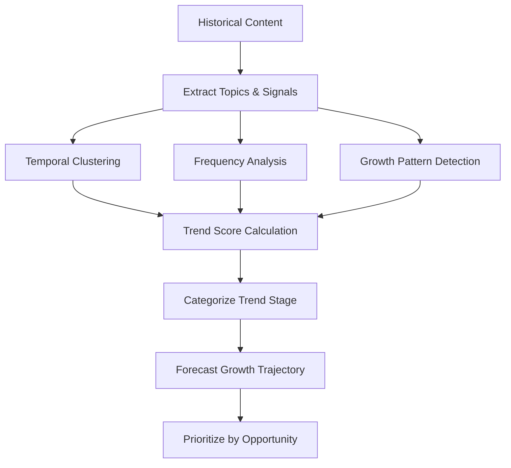
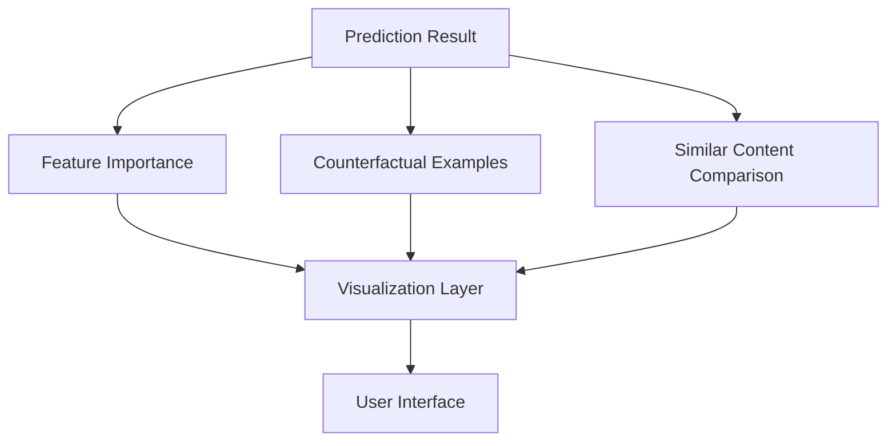
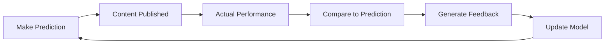
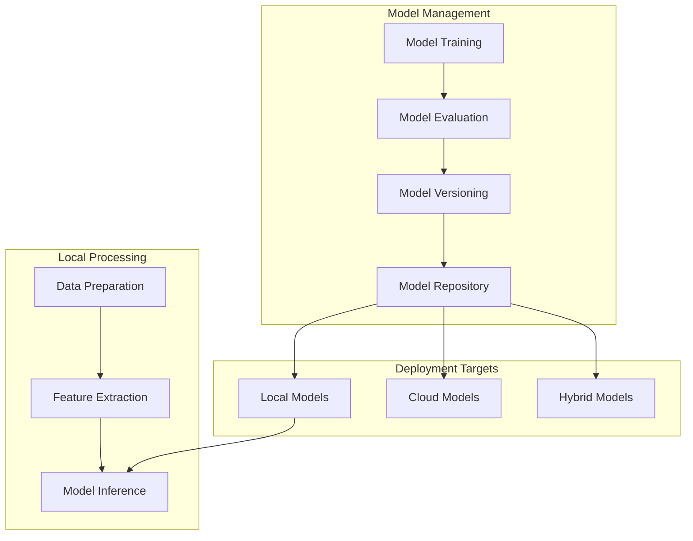

# Machine Learning Models

This document provides technical details about the machine learning models used in CherryBomb for content performance prediction and trend analysis.

## Model Architecture Overview

CherryBomb employs a multi-model approach to address different prediction tasks:

## Model Types and Applications

| Model Type | Application | Algorithms Used | Input Features | Output |
|------------|-------------|-----------------|----------------|--------|
| Engagement Prediction | Forecasting likes, comments, shares | Gradient Boosting, Neural Networks | Content features, historical performance, audience data | Predicted engagement metrics with confidence intervals |
| Trend Detection | Identifying emerging topics | Time Series Analysis, Topic Modeling | Historical content across accounts, keyword frequencies | Trend forecasts with growth potential |
| Content Optimization | Suggesting content improvements | Reinforcement Learning, A/B Testing Models | Draft content, performance goals | Actionable content modifications |
| Audience Response | Predicting demographics response | Classification, Clustering | Content features, demographic engagement patterns | Segment-specific engagement predictions |
| Timing Optimization | Optimal posting schedule | Time Series Analysis, Heatmapping | Historical timing data, engagement patterns | Recommended posting windows |

## Feature Engineering

CherryBomb extracts over 500 features from social media content to power predictive models:

### Text Features
- Sentiment analysis (positive/negative/neutral)
- Emotional tone mapping (joy, anger, fear, etc.)
- Readability scores (Flesch-Kincaid, SMOG)
- Topic categorization
- Keyword density and relevance
- Hashtag analysis (count, popularity, relevance)
- Question presence and types
- Call-to-action presence and types
- Text length metrics (character count, word count)
- Language complexity metrics

### Image Features
- Object detection and classification
- Scene categorization
- Color palette analysis
- Brightness, contrast, saturation
- Composition analysis
- Face detection and emotion recognition
- Text overlay detection and analysis
- Brand element recognition
- Image quality metrics
- Style categorization (illustration, photography, graphic)

### Video Features
- Duration and pacing
- Scene changes frequency
- Audio analysis (music, speech, silence ratios)
- Motion intensity
- Caption presence and coverage
- Thumbnail effectiveness
- Opening hook analysis
- Transition types and frequency
- Editing style metrics
- Narrative structure identification

### Contextual Features
- Day of week and time of day
- Proximity to holidays/events
- Account historical performance metrics
- Industry vertical benchmarks
- Platform-specific algorithm indicators
- Content recency factors
- Competitive landscape metrics
- Category saturation indicators
- Platform feature utilization

## Model Training Methodology

CherryBomb uses a systematic approach to train high-quality prediction models:

### 1. Data Preprocessing
- Outlier detection and handling
- Missing value imputation
- Time-based feature normalization
- Category encoding
- Feature scaling

### 2. Training Process
- Train/validation/test splitting (70/15/15 by default)
- Cross-validation with time-based folding
- Hyperparameter optimization via Bayesian methods
- Regularization to prevent overfitting
- Incremental learning for model updates

### 3. Evaluation Metrics
- Mean Absolute Error (MAE) for engagement predictions
- Root Mean Squared Error (RMSE) for numeric predictions
- Precision/Recall for classification tasks
- AUC-ROC for ranking effectiveness
- Calibration curves for probability estimates

## Platform-Specific Models

CherryBomb trains separate models for each social media platform to capture platform-specific dynamics:

| Platform | Model Specializations | Special Features |
|----------|----------------------|-----------------|
| Instagram | Visual engagement prediction, hashtag effectiveness | Image aesthetic score, carousel optimization |
| TikTok | Video virality prediction, audio track influence | Trend participation impact, hook effectiveness |
| YouTube | Retention prediction, subscriber conversion | Thumbnail click-through rate, watch time optimization |
| Twitter | Conversation generation, retweet prediction | Thread structure optimization, viral potential |
| Facebook | Demographic targeting, reach prediction | Algorithm visibility factors, share probability |
| LinkedIn | Professional engagement, comment quality | Industry relevance scoring, professional value signals |

## Model Performance Benchmarks

Performance benchmarks across different platforms and prediction tasks:

| Prediction Task | Accuracy | Error Margin | Confidence Level |
|-----------------|----------|--------------|------------------|
| Instagram Likes | 82% | ±12% | 90% |
| TikTok Views | 78% | ±15% | 85% |
| YouTube Watch Time | 80% | ±10% | 90% |
| Twitter Retweets | 75% | ±18% | 80% |
| Trending Topic Detection | 70% | ±25% | 75% |
| Best Time to Post | 85% | ±2 hours | 90% |

## Content Optimization Models

CherryBomb's content optimization models suggest modifications to improve predicted performance:

### Optimization Objectives

Models can optimize for different objectives:
- Maximize total engagement
- Maximize reach
- Maximize conversion rate
- Balance multiple metrics
- Target specific audience segments

### Optimization Techniques

The optimization process uses:
- A/B variant testing simulation
- Reinforcement learning for suggestion generation
- Sensitivity analysis to identify highest-impact changes
- Domain-specific heuristics for different content types
- User feedback incorporation for continuous improvement

## Trend Detection and Forecasting

CherryBomb's trend detection models identify emerging topics before they reach peak popularity:

### Trend Identification Methods

The trend forecasting models use:
- Early signal detection to identify trends in nascent stages
- Growth curve fitting to project trend trajectories
- Anomaly detection to identify potential viral content
- Seasonality analysis to differentiate cyclical vs. novel trends
- Cross-platform correlation to validate trend significance

## Audience Segmentation Models

CherryBomb uses unsupervised and supervised learning to segment audiences and predict segment-specific responses:

### Segmentation Dimensions

- Demographic segments (age, gender, location)
- Behavioral segments (engagement patterns, content preferences)
- Psychographic segments (interests, values, attitudes)
- Platform usage segments (frequency, features used)
- Content response segments (engagement type patterns)

### Segment Response Prediction

For each identified segment, separate prediction models forecast:
- Engagement likelihood
- Engagement type distribution
- Conversion probability
- Content relevance score
- Growth potential

## Model Interpretability

CherryBomb prioritizes interpretable machine learning:

### Explainable AI Techniques

- SHAP (SHapley Additive exPlanations) values for feature importance
- Partial dependence plots for feature impact visualization
- Counterfactual explanations for content recommendations
- Decision tree visualization for classification models
- Attention mechanism visualization for neural networks

### Interpretability Interface

## Continuous Improvement System

CherryBomb models improve over time through:

### Learning Feedback Loop

### Model Versioning and Validation

- Production models are versioned and shadow-tested before deployment
- A/B testing of model versions against control groups
- Continuous backtesting against historical data
- Drift detection to identify when retraining is needed
- Performance monitoring with alerting for accuracy degradation

## Technical Implementation

### Core ML Libraries

- TensorFlow/Keras for deep learning models
- LightGBM/XGBoost for gradient boosting models
- Scikit-learn for preprocessing and classical ML
- PyTorch for specialized neural network architectures
- Gensim for topic modeling and text processing

### Optimization Techniques

- ONNX model conversion for cross-platform deployment
- Model quantization for size and performance optimization
- Batch prediction for efficiency
- GPU acceleration where available
- CPU optimization for standard deployments

### Deployment Architecture

## Future Development Roadmap

CherryBomb's machine learning capabilities are continuously evolving:

### Upcoming Model Improvements

- **Multimodal Learning**: Deeper integration of text, image, and video understanding
- **Cross-Platform Modeling**: Unified models that leverage patterns across platforms
- **Causal Inference**: Moving beyond correlation to identify causal factors in content performance
- **Zero-Shot Learning**: Prediction for content types with little historical data
- **User-Specific Models**: Personalized models trained on specific account dynamics
- **Reinforcement Learning**: End-to-end content optimization through iterative improvement

### Research Directions

- **Algorithm Understanding**: Models that adapt to platform algorithm changes
- **Creativity Support**: AI-assisted content ideation based on predicted performance
- **Ethical AI**: Fairness-aware models that avoid problematic optimization directions
- **Audience Building**: Predictive models for audience growth strategies
- **Content Planning**: Long-term content strategy optimization across platforms
