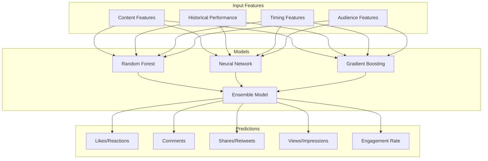
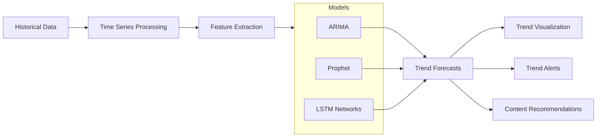
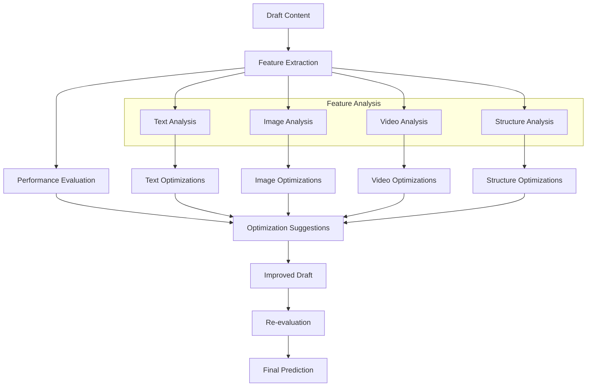
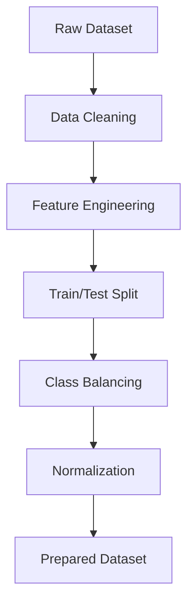
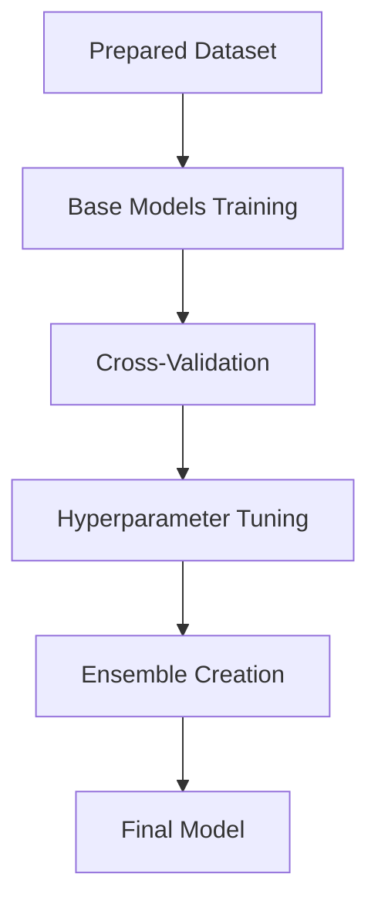
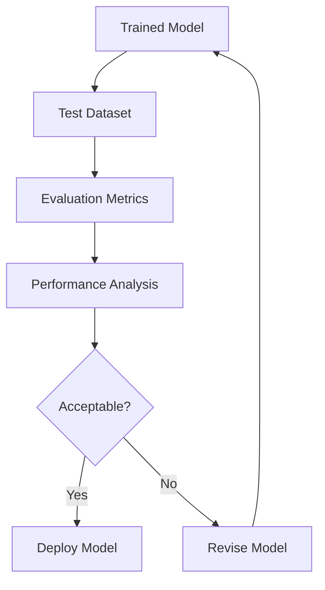
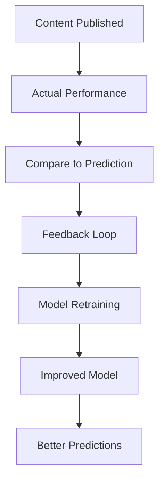

# Prediction Models

Prediction models are at the heart of CherryBomb's ability to forecast content performance, identify trends, and optimize your social media strategy. This document explains how prediction models work, what types are available, and how to leverage them for your content.

## Understanding CherryBomb's Prediction Technology

CherryBomb uses advanced machine learning techniques to analyze your historical social media data and build predictive models that can forecast how new content will perform before you publish it.

### Core Prediction Capabilities

1. **Engagement Prediction**: Forecast likes, comments, shares, and overall engagement
2. **Audience Response**: Predict how specific audience segments will respond
3. **Content Optimization**: Identify changes to improve predicted performance
4. **Trend Forecasting**: Predict emerging trends in your niche
5. **Best Posting Times**: Determine optimal publishing schedules

## Model Types

CherryBomb employs different types of prediction models depending on the specific task:

### Engagement Prediction Models

These models predict specific engagement metrics for content before publication:

- **Regression Models**: Predict exact metric values (likes, comments, etc.)
- **Classification Models**: Categorize content into performance tiers
- **Ensemble Methods**: Combine multiple models for more robust predictions

### Trend Detection Models

These models identify and predict trends in your niche:

- **Time Series Models**: Detect patterns and cycles over time
- **Topic Modeling**: Identify emerging topics and themes
- **Anomaly Detection**: Flag unusual patterns that may indicate viral potential

### Content Optimization Models

These models suggest specific changes to improve content performance:

- **A/B Testing Models**: Learn from historical content variations
- **Feature Importance**: Identify which content elements drive engagement
- **Multivariate Optimization**: Balance multiple factors for optimal results

## How Models Are Trained

CherryBomb's prediction models are trained using a multi-stage process:

### 1. Data Preparation

- **Data Cleaning**: Remove outliers and handle missing values
- **Feature Engineering**: Create derived features and extract meaningful signals
- **Data Splitting**: Separate training, validation, and test data
- **Class Balancing**: Ensure representation of all performance levels
- **Normalization**: Scale features for optimal model performance

### 2. Model Training

- **Base Model Training**: Train multiple model types on your data
- **Cross-Validation**: Ensure models generalize well to new content
- **Hyperparameter Tuning**: Optimize model parameters for your specific data
- **Ensemble Creation**: Combine models to improve prediction accuracy

### 3. Model Evaluation

- **Accuracy Metrics**: Measure prediction precision and recall
- **Error Analysis**: Identify where models make mistakes
- **Confidence Scoring**: Determine prediction reliability
- **Comparative Evaluation**: Compare against previous model versions

## Prediction Features

CherryBomb analyzes numerous features when making predictions:

### Content Features

| Feature Category | Examples | Impact |
|------------------|----------|--------|
| **Text Analysis** | Sentiment, readability, keyword usage, hashtag relevance | High impact on audience resonance |
| **Image Analysis** | Colors, composition, object detection, text overlay | Critical for visual platforms |
| **Video Analysis** | Duration, pace, scene changes, audio quality | Key for video engagement |
| **Structure** | Post length, format, attachment types | Affects initial impression |

### Contextual Features

| Feature Category | Examples | Impact |
|------------------|----------|--------|
| **Timing** | Day of week, time of day, proximity to events | Affects visibility window |
| **Account** | Account size, recent engagement, posting frequency | Sets baseline expectations |
| **Audience** | Demographics, online behaviors, interests | Determines relevance |
| **Platform** | Platform-specific algorithms, feature usage | Shapes distribution potential |

## Using Prediction Models

### Getting Started with Predictions

1. **Train Initial Models**: Allow CherryBomb to analyze your historical data
2. **Draft Content**: Create your content draft within CherryBomb
3. **Request Prediction**: Have models analyze your draft
4. **Review Predictions**: See forecasted performance metrics
5. **Apply Suggestions**: Implement optimization recommendations
6. **Publish Confidently**: Schedule content with performance insights

### Prediction Accuracy

Prediction accuracy depends on several factors:

- **Data Volume**: More historical data generally improves accuracy
- **Data Recency**: Recent data captures current algorithm behaviors
- **Content Similarity**: Predictions are stronger for content similar to your history
- **Platform Stability**: Algorithm changes may temporarily affect accuracy

Typical accuracy ranges:

- **Engagement Tier Prediction**: 75-85% accuracy
- **Exact Metric Prediction**: ±15-25% margin of error
- **Trend Direction Prediction**: 70-80% accuracy

### Model Improvement Over Time

CherryBomb models automatically improve as they learn from new data:

- **Continuous Learning**: Models update as new content performance data is collected
- **Feedback Integration**: Compare predictions to actual results
- **Adaptive Algorithms**: Adjust to changing platform algorithms and audience behaviors
- **Custom Tuning**: Models specialize to your specific content and audience

## Advanced Prediction Capabilities

### Multivariate Optimization

Optimize content for multiple metrics simultaneously:

- Balance engagement metrics with conversion goals
- Find optimal compromise between reach and engagement depth
- Consider both short-term performance and long-term account growth

### Cross-Platform Predictions

Predict how the same content will perform across different platforms:

- Identify platform-specific optimization opportunities
- Compare expected performance across platforms
- Recommend platform-specific modifications

### Audience Segment Predictions

Forecast performance across different audience segments:

- Demographic-based predictions
- Geographic performance variations
- Interest group engagement differences

## Best Practices for Prediction Accuracy

1. **Consistent Data Collection**: Maintain regular data collection for all accounts
2. **Diverse Content Testing**: Publish varied content to help models learn
3. **Regular Model Retraining**: Retrain models at least monthly
4. **Verify Predictions**: Compare actual results to predictions to gauge accuracy
5. **Contextual Awareness**: Consider external factors that models may not capture

## Technical Model Details

For technically inclined users, CherryBomb employs these model architectures:

### Engagement Prediction

- **Primary Models**: Gradient Boosted Decision Trees (XGBoost, LightGBM)
- **Supplementary Models**: Deep Neural Networks, Support Vector Regression
- **Ensemble Method**: Stacked Generalization

### Content Analysis

- **Text Processing**: BERT-based language models, TF-IDF vectorization
- **Image Analysis**: Convolutional Neural Networks (ResNet, EfficientNet)
- **Video Analysis**: Frame-sequence models, audio-visual feature extraction

### Trend Detection

- **Time Series**: Prophet, ARIMA, LSTM networks
- **Topic Modeling**: LDA, BERTopic
- **Anomaly Detection**: Isolation Forests, Autoencoder Networks

## Future Directions

CherryBomb's prediction capabilities are continuously evolving:

- **Causality Analysis**: Understanding why certain content performs better
- **Creative Assistance**: AI-generated content improvement suggestions
- **Competitive Intelligence**: Predicting competitor content performance
- **Algorithm Change Detection**: Identifying platform algorithm shifts
- **Viral Potential Scoring**: Predicting potential for exponential growth
