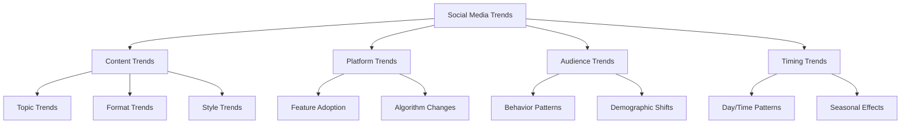
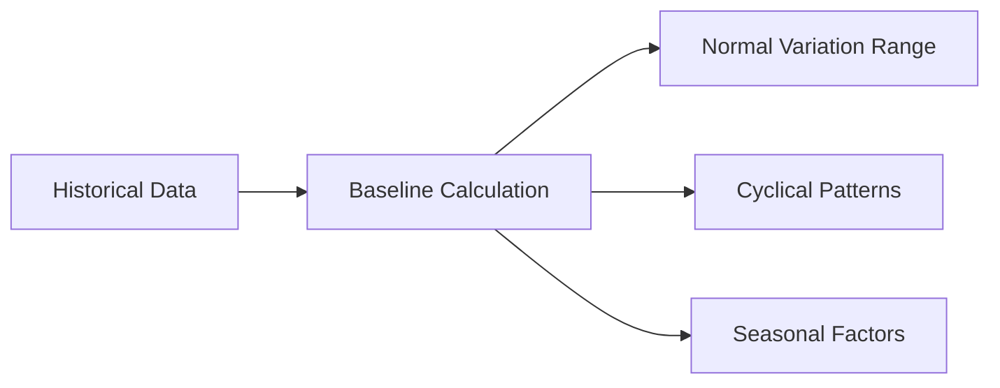
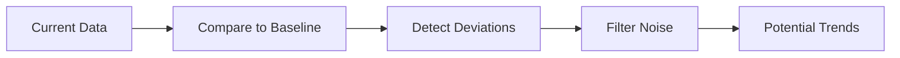
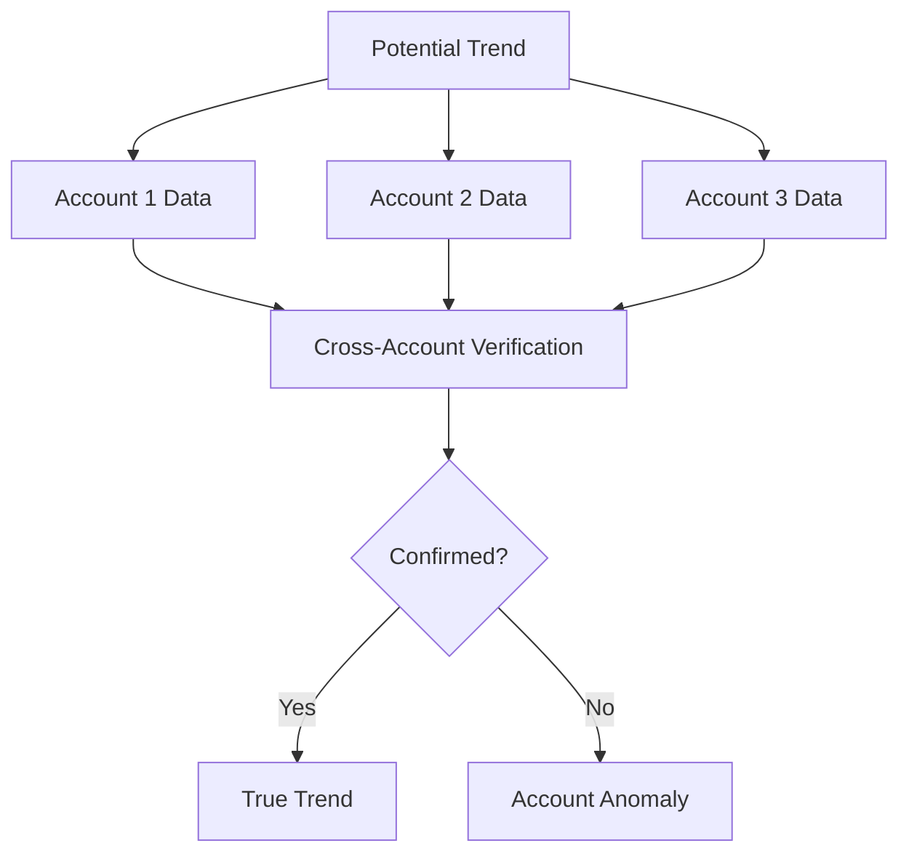
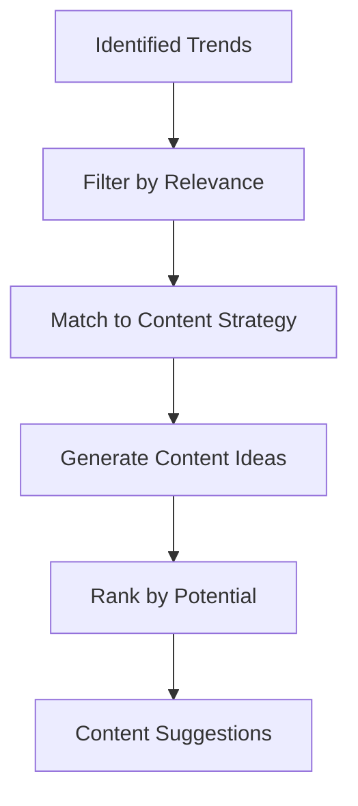
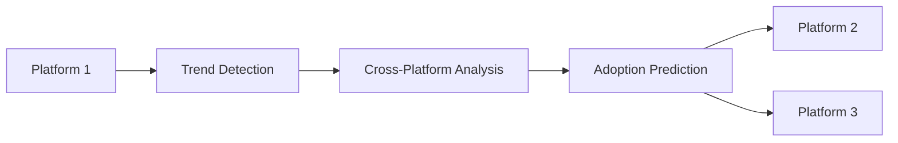
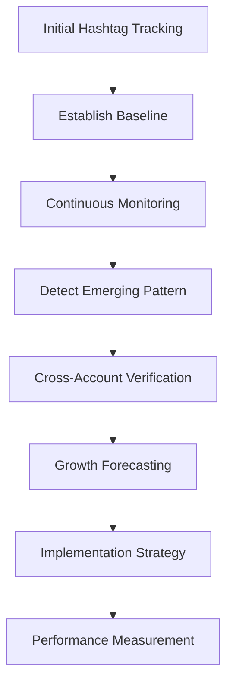

# Trend Analysis

Trend analysis is a key capability of CherryBomb that helps you identify emerging patterns, popular content themes, and shifts in audience behavior across social media platforms. This document explains how trend analysis works and how to leverage it for your content strategy.

## Understanding Trend Analysis

Trend analysis in CherryBomb involves identifying, measuring, and predicting patterns in social media data that indicate shifts in content performance, audience preferences, or platform dynamics.

### Types of Trends CherryBomb Identifies

## How CherryBomb Detects Trends

CherryBomb uses a multi-layered approach to identify and analyze trends:

### 1. Historical Pattern Analysis

The system establishes baselines by analyzing historical data to understand normal performance patterns and fluctuations.

### 2. Deviation Detection

CherryBomb identifies potential trends by looking for statistically significant deviations from established patterns.

### 3. Cross-Account Verification

To separate account-specific anomalies from true trends, CherryBomb verifies patterns across multiple accounts.

### 4. Temporal Analysis

Trends have different lifecycle phases. CherryBomb classifies trends based on their temporal characteristics:

| Trend Phase | Characteristics | Detection Signals | Strategic Value |
|-------------|----------------|-------------------|-----------------|
| **Emerging** | Low volume, rapid growth | Sudden increase from zero/low baseline | Early adoption opportunity |
| **Growing** | Increasing volume, accelerating | Consistent growth over short term | Prime implementation time |
| **Peaking** | High volume, stable | Plateau after growth period | Mass appeal period |
| **Declining** | Decreasing volume | Consistent decrease from peak | Consider phasing out |
| **Cyclical** | Recurring patterns | Predictable rises and falls | Timing optimization |

## Trend Categories and Metrics

CherryBomb analyzes trends across multiple dimensions:

### Content Trend Metrics

- **Topic Trends**: Emerging subjects, themes, and conversation topics
- **Format Trends**: Rising popularity of specific content formats (Reels, Stories, etc.)
- **Style Trends**: Visual aesthetics, editing styles, music trends
- **Hashtag Trends**: Emerging and declining hashtags
- **Language Trends**: Changes in language, slang, and expression

### Performance Trend Metrics

- **Engagement Patterns**: Shifts in how users engage with content
- **Growth Rates**: Changes in follower acquisition patterns
- **View Depth**: Trends in content consumption depth
- **Conversion Trends**: Changes in action-taking behavior

### Audience Trend Metrics

- **Demographic Shifts**: Changes in audience composition
- **Activity Patterns**: When and how audiences engage
- **Interest Evolution**: Shifting topics of interest
- **Cross-Platform Behavior**: Changes in multi-platform usage

## Using Trend Analysis in CherryBomb

### Trend Dashboard

The Trend Dashboard provides a real-time view of detected trends relevant to your niche:

1. **Trend Timeline**: Visual representation of trend lifecycle
2. **Impact Score**: Predicted significance of each trend
3. **Relevance Rating**: How applicable the trend is to your content
4. **Implementation Suggestions**: Ways to leverage the trend

### Trend Alerts

Configure alerts to notify you of significant trend developments:

- Emerging trends in your niche
- Sudden changes in content performance patterns
- Platform algorithm updates detected
- Competitor strategy shifts

### Trend-Based Content Suggestions

CherryBomb generates content ideas based on identified trends:

## Advanced Trend Analysis Features

### Cross-Platform Trend Analysis

Identify how trends move between platforms and predict cross-platform adoption:

### Trend Forecasting

CherryBomb predicts the future development of identified trends:

- **Growth Projection**: Expected amplification rate
- **Longevity Prediction**: How long the trend will remain relevant
- **Peak Timing**: When the trend will reach maximum adoption
- **Decay Rate**: How quickly the trend will decline

### Competitor Trend Adoption

Track how competitors are responding to trends:

- Which trends they're adopting quickly
- Which trends they're ignoring
- How successfully they're implementing trend-based content
- Innovative ways they're adapting trends

## Best Practices for Trend Analysis

1. **Focus on Relevant Trends**: Not every trend deserves your attention
2. **Consider Trend Lifecycle Stage**: Different stages require different approaches
3. **Balance Trendy and Evergreen Content**: Don't chase every trend at the expense of your core content
4. **Adapt Trends to Your Brand**: Customize trend implementation to fit your voice
5. **Measure Trend ROI**: Track the performance of trend-based content

## Examples of Trend Analysis in Action

### Case Study: Hashtag Evolution Analysis

1. **Initial State**: CherryBomb detected a subtle increase in a niche hashtag
2. **Verification**: Confirmed across multiple accounts in the niche
3. **Forecasting**: Predicted significant growth over next 2 weeks
4. **Implementation**: Created content using the trending hashtag
5. **Results**: 47% higher engagement than non-trend content

### Case Study: Format Trend Identification

1. **Detection**: Identified increasing performance of tutorial-style content
2. **Analysis**: Determined optimal length, style, and approach
3. **Implementation**: Adapted existing content to tutorial format
4. **Results**: Increased average watch time by 35%

## Customizing Trend Analysis

### Setting Your Trend Parameters

Configure CherryBomb's trend detection sensitivity:

- **Relevance Threshold**: How closely a trend must match your niche
- **Growth Threshold**: Minimum growth rate to flag as a trend
- **Verification Level**: How many accounts must show the pattern
- **Alert Sensitivity**: How significant a trend must be for alerts
