# Frontend Dashboard

This document outlines the structure and functionality of the main dashboard in the CherryBomb desktop application.

## Overview

The dashboard serves as the central hub for users, providing an at-a-glance view of key metrics, recent activity, upcoming scheduled content, and quick access to major application features.

## Key Sections

```mermaid
graph TD
    Dashboard --> SummaryMetrics[Summary Metrics Section]
    Dashboard --> RecentActivity[Recent Activity Feed]
    Dashboard --> UpcomingPosts[Upcoming Posts Section]
    Dashboard --> QuickActions[Quick Actions Panel]
    Dashboard --> Navigation[Main Navigation]

    SummaryMetrics --> OverallPerformance[Overall Account Performance]
    SummaryMetrics --> EngagementTrends[Engagement Trends]
    SummaryMetrics --> AudienceGrowth[Audience Growth]

    RecentActivity --> NewFollowers[New Followers/Subscribers]
    RecentActivity --> RecentMentions[Recent Mentions]
    RecentActivity --> CompletedTasks[Completed Collection/Analysis Tasks]

    UpcomingPosts --> ScheduledPost1[Scheduled Post 1]
    UpcomingPosts --> ScheduledPost2[Scheduled Post 2]
    UpcomingPosts --> ViewFullCalendar[View Full Calendar Button]

    QuickActions --> NewDraft[Create New Draft]
    QuickActions --> StartCollection[Start Data Collection]
    QuickActions --> RunAnalysis[Run Analysis]
    QuickActions --> ViewReports[View Reports]
```

### 1. Summary Metrics Section

- Displays key performance indicators (KPIs) aggregated across connected accounts or for a selected project.
- Customizable widgets for metrics like total followers, average engagement rate, recent post performance, etc.
- Date range selectors to view metrics for different periods (e.g., last 7 days, last 30 days, custom range).

### 2. Recent Activity Feed

- Shows a chronological list of important events and notifications.
- Examples: new high-performing content detected, data collection job completed, significant audience interaction, new trend alert.
- Clickable items leading to more detailed views.

### 3. Upcoming Posts Section

- A preview of content scheduled for publishing in the near future (e.g., next 3-5 posts).
- Displays thumbnail, caption snippet, scheduled time, and target platform(s).
- Quick links to edit or reschedule the post.
- A button to navigate to the full content calendar.

### 4. Quick Actions Panel

- Provides shortcuts to frequently used actions.
- Examples: "Create New Content Draft", "Start New Data Collection", "Analyze Dataset", "Generate Report".
- Context-aware actions based on the current project or view.

### 5. Main Navigation

- Consistent navigation bar or sidebar providing access to all major sections of the application:
  - Dashboard
  - Data Collection
  - Datasets
  - Analysis & Reports
  - Prediction Models
  - Content Calendar
  - Account Management
  - Settings

## Customization

- Users can customize the dashboard layout by adding, removing, or rearranging widgets.
- Different dashboard profiles can be saved for various workflows or projects.

## Technical Details

- Built using React components.
- State management handled by Redux or a similar library.
- Data is fetched asynchronously from local storage and/or backend services.
- Charts and graphs are rendered using D3.js or a similar charting library.

This dashboard is designed to be informative, actionable, and user-friendly, providing a powerful starting point for users to manage their social media presence effectively.
