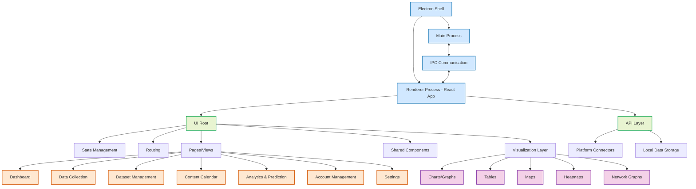

# Frontend Overview

CherryBomb's frontend is a modern, cross-platform desktop interface built with Electron and React, designed for usability, performance, and extensibility. This section provides an overview of the frontend architecture, key user journeys, and major UI components.

---

## Technology Stack

- **Electron**: Desktop shell using web technologies for cross-platform support
- **React**: Component-based UI framework for dynamic, maintainable interfaces
- **TypeScript**: Static typing for safer, more robust code
- **State Management**: Redux, Zustand, or Context API for predictable data flow
- **Styling**: CSS Modules, Styled-Components, or Tailwind CSS for modular, scalable styles
- **Visualization**: D3.js, Recharts, or Chart.js for advanced data visualization
- **Data Fetching**: Axios or Fetch API for local and remote data access
- **Testing**: Jest and React Testing Library for unit and integration tests

---

## Core User Journeys

1. **Dashboard**: At-a-glance metrics, recent activity, and quick actions
2. **Data Collection**: Connect accounts, configure collection, monitor progress
3. **Dataset Management**: Organize, filter, and export datasets
4. **Content Calendar**: Plan, schedule, and manage posts visually
5. **Analysis & Prediction**: Interactive reports, trend visualizations, and actionable suggestions
6. **Account & Settings**: Manage connected accounts, user profile, and preferences

---

## Main UI Components

- **Dashboard**: Central hub for metrics, activity, and navigation
- **Data Collection Wizard**: Step-by-step flow for connecting and scraping accounts
- **Dataset Explorer**: Browse, filter, and manage datasets
- **Content Calendar**: Visual scheduling and management of posts
- **Prediction & Analytics**: Interactive charts, trend analysis, and optimization suggestions
- **Account Management**: Connect, group, and manage social media accounts
- **Settings**: User profile, preferences, and application configuration

---

## Frontend Architecture Diagram

---

## Best Practices

- **Responsive Design**: Ensure usability across screen sizes and OSes
- **Accessibility**: Follow WCAG guidelines for inclusive design
- **Performance**: Optimize rendering and data fetching for large datasets
- **Modularity**: Use reusable components and clear separation of concerns
- **User Feedback**: Provide real-time progress, error handling, and actionable notifications
- **Security**: Safeguard user data and credentials in the UI

---

For details on each UI section, see the dedicated documentation pages for Dashboard, Data Visualization, Content Calendar, and Account Management.
